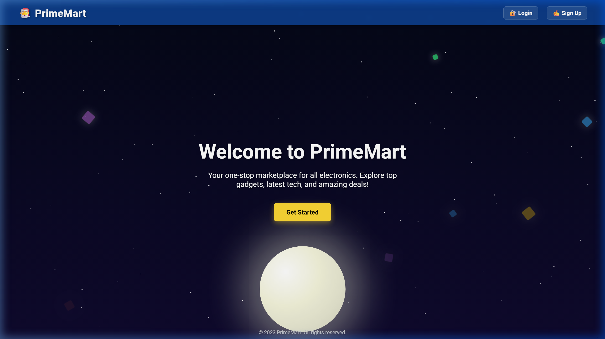
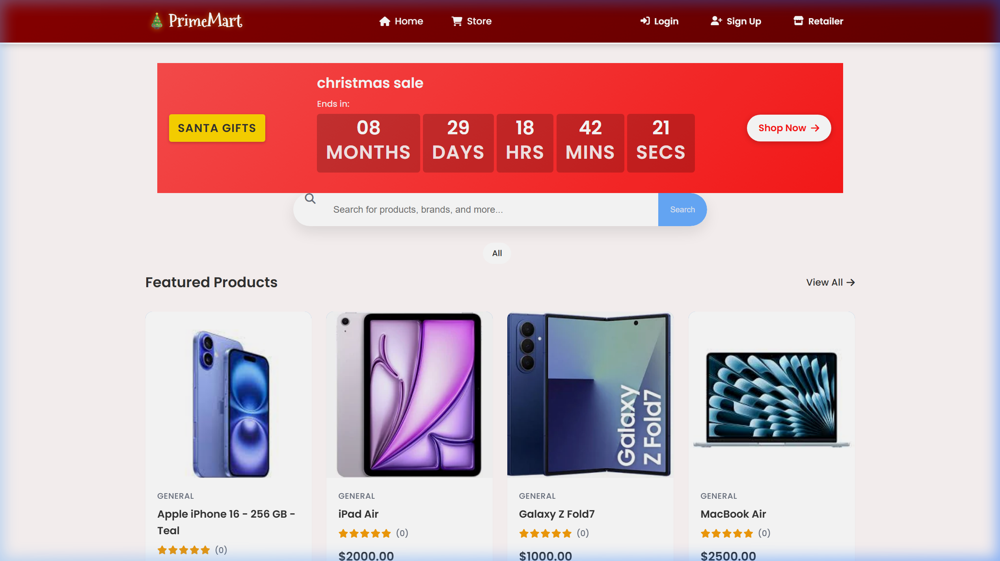
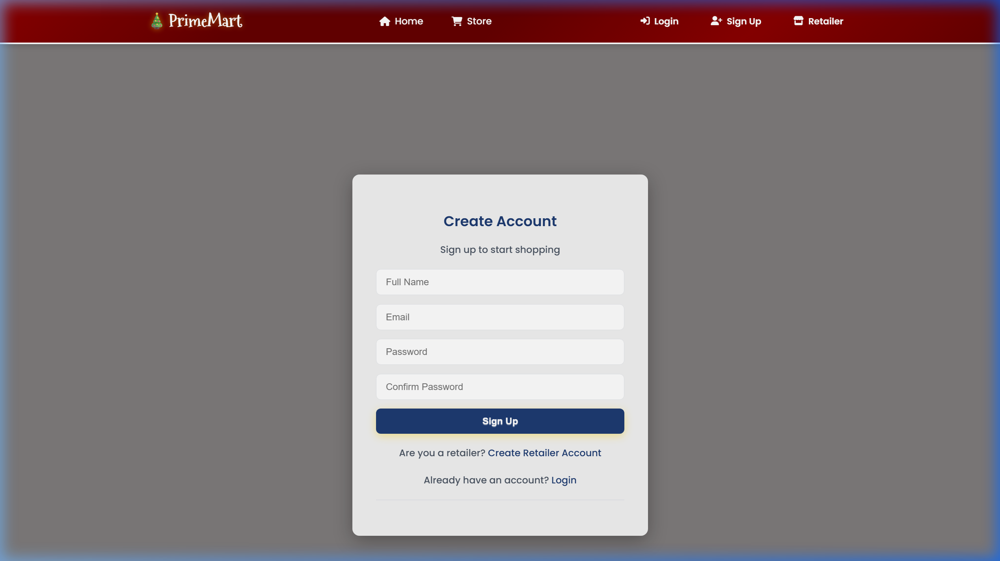
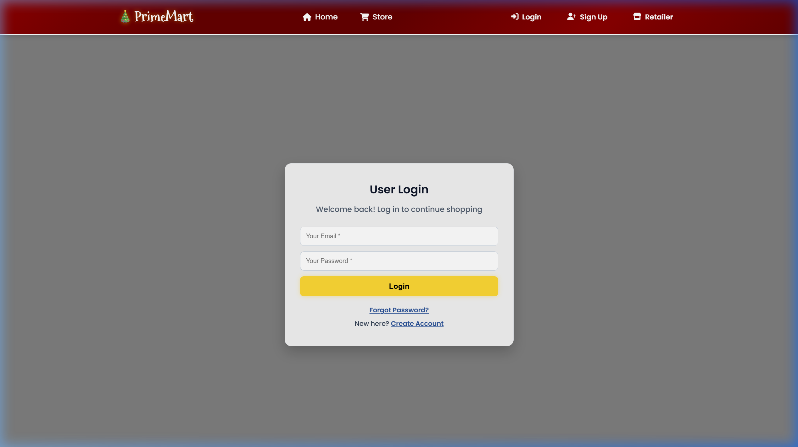

# PrimeMart - Electronics Marketplace

PrimeMart is a modern, responsive electronics marketplace built with Flask and MongoDB. It features a stunning animated UI, user authentication, product management, shopping cart, and more.

## Features

- 🌟 **Dynamic UI**: Animated night sky landing page with interactive elements.
- 🔐 **Authentication**: Secure login and signup for users and retailers.
- 🛒 **Shopping Cart**: Real-time cart management with stock validation.
- 📦 **Order Management**: Track orders and generate digital receipts.
- 🛍️ **Retailer Dashboard**: Manage products, stock, and view sales.
- 💳 **Payments**: Integrated payment flow (simulated/Stripe).

### Screenshots






## Project Structure

```text
/
├── marketplace/          # Core package
│   ├── routes/           # Blueprint route handlers
│   ├── templates/        # HTML templates
│   ├── static/           # CSS, JS, and Images
│   ├── models.py         # MongoDB data models
│   ├── config.py         # Application configuration
│   └── __init__.py      # App factory
├── run.py                # Entry point
├── .gitignore            # Git exclusion rules
├── requirements.txt      # Python dependencies
└── README.md             # Project documentation
```

## Getting Started

### Prerequisites

- Python 3.8+
- MongoDB (Running locally or on Atlas)

### Installation

1. Clone the repository:
   ```bash
   git clone https://github.com/Nasaniamoghvarsha/PrimeMart-festival-.git
   cd PrimeMart-festival-
   ```

2. Create and activate a virtual environment:
   ```bash
   python -m venv .venv
   # Windows:
   .venv\Scripts\activate
   # Unix/macOS:
   source .venv/bin/activate
   ```

3. Install dependencies:
   ```bash
   pip install -r requirements.txt
   ```

4. Set up environment variables:
   Create a `.env` file in the root directory:
   ```text
   SECRET_KEY=your_secret_key
   MONGO_URI=mongodb://localhost:27017
   DB_NAME=marketplace
   ```

## Running the Application

Start the development server:
```bash
python run.py
```
The application will be available at `http://localhost:5001`.

## License

This project is licensed under the MIT License - see the [LICENSE](LICENSE) file for details.
